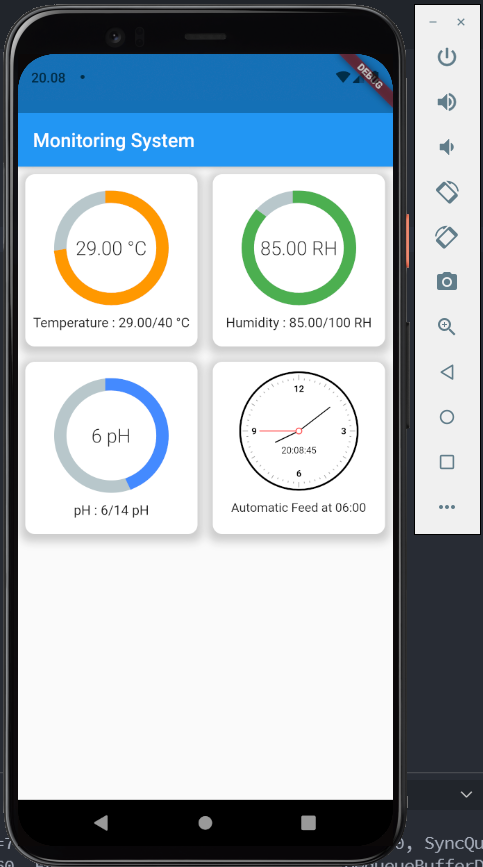

# Flutter Monitoring Suhu dan pH Air
Flutter Monitoring Suhu dan pH air menggunakan NodeMCU dan CodeIgniter sebagai API

## API

API, Database and Arduino Code

API
https://github.com/renol767/IoT_pH_Suhu_WebAPI

Database
https://github.com/renol767/IoT_pH_Suhu_WebAPI/blob/master/sensor.sql

Arduino Code
https://github.com/renol767/IoT_pH_Suhu_WebAPI/blob/master/Arduino/Code%20DHT_11MySQL/Code_DHT11_MySQL.ino

### Screenshot

Screenshot Flutter App

